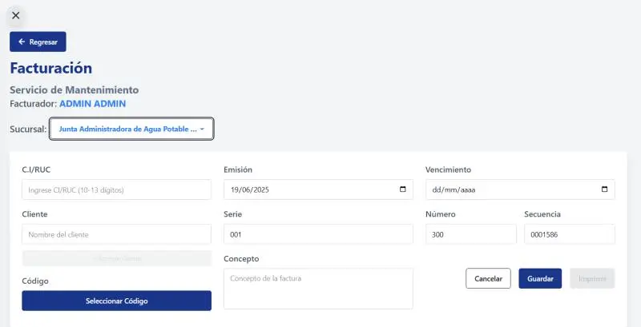

## Hi, I'm Daniel Fuelpaz

	

Software Engineer specialized in **full-stack web development** with 3+ years of experience building scalable applications. I've developed systems ranging from government platforms to enterprise management applications, always prioritizing **user experience** and **development best practices**.

🎯 **My approach:** I combine solid technical knowledge with teamwork skills to deliver products that truly solve problems.

🔧 **Currently exploring:** GraphQL, microservices architecture, and game development with Godot.

---

### Highlights
- **Education:** Software Engineering — Technical University of Ambato (8th semester)
- **Experience:** 4+ projects developed (academic and professional)
- **Collaboration:** Teamwork with developers and designers
- **Specialization:** APIs (GraphQL/REST), microservices, React/React Native and game development

### 📊 By the numbers
🚀 **4+** completed projects | 💻 **6+** mastered technologies | 🤝 **4+** active collaborators | 🎓 **8th semester** student

---

### Featured Projects

#### 🚀 [Sambi](https://github.com/D4rkGh057/sambi)

**Stack:** HTML,CSS3,JS

**Problem it solves:** A professional digital showcase for Sambi's handmade chocolates and personalized gifts. 

📍 *Professional project*  
🔗 **[View code](https://github.com/D4rkGh057/sambi)** | 🌐 **[Live demo](https://d4rkgh057.github.io/sambi)** *(coming soon)*

#### 💼 [SmarTramites](https://github.com/D4rkGh057/frontend_GADMA)

**Stack:** React, TypeScript, REST APIs  
**Problem it solves:** Digitization of government procedures to improve citizen experience  
📍 *Institutional frontend*  
🔗 **[View code](https://github.com/D4rkGh057/frontend_GADMA)**

#### 🚰 [Sistema de cobro Junta de Agua Santa Rosa](https://github.com/ArielTonato/Junta-De-Agua)

**Stack:** React.js, Nest.js, Tailwind CSS  
**Problem it solves:** Web system designed for the comprehensive management of drinking water collections for the 'Junta de Agua Santa Rosa'.  

📍 *Community Outreach project*  
🔗 **[View code](https://github.com/ArielTonato/Junta-De-Agua)**

---

### Technologies

A visual selection of technologies and tools I work with regularly.

#### 🖍 Design
 

#### 🗄️ Databases
  

#### 💻 Languages
    

#### ⚙️ Frameworks and tools
     

---

### Top Languages

### Graphs

---

### Education

- Software Engineering — Technical University of Ambato (in progress)

---

### How to contact me

- Email: danielfuelpaz@outlook.com  
- LinkedIn: https://www.linkedin.com/in/daniel-fuelpaz/  

<!-- Botón para visualizar CV -->

	

---

### 🎯 What I'm looking for

**Ideal position:** Junior Full-Stack Developer or Frontend Developer at startups or tech companies

**Specifically looking for:**
- 💻 Roles where I can work with **React/TypeScript** and **Node.js**
- 🚀 Agile teams that value **best practices** and **code reviews**
- 📈 Growth opportunities in **software architecture** and **DevOps**
- 🌍 Remote or hybrid work (based in Ecuador)

**Does your team fit?** 👇 Write to me and let's talk about how I can add value from day one.

---

### Partners

| [@JosliBlue](https://github.com/JosliBlue) | [@G4TO](https://github.com/CarlosAl21) | [@ArielTonato](https://github.com/ArielTonato) | [@FelixMF](https://github.com/FelixMF) |
|-------------|-------------|-------------|-------------|
|  |  |  |  |

---

Thanks for visiting my profile — I hope we can work together!
